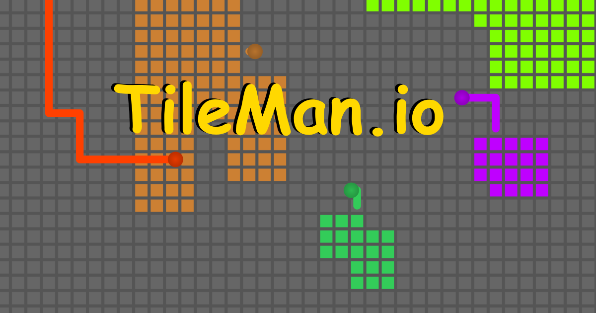

# EciPixels

**This is a full-stack web application project utilizing a layered architecture.**

The project is based on tileman.io, it is a multiplayer online game where players compete to capture territory by drawing lines around it.

The technology stack includes:
* Backend: Java, Spring Boot, REST
* Frontend: Angular
* Cache: Redis
* Interface: HTML, CSS, JavaScript

## Diagrams

## Team members

* Andres Felipe Arias Ajiaco
* Cesar David Amaya Gomez 
* Johan Sebastian Garcia Martinez 
* Sebastian David Blanco Rodriguez

